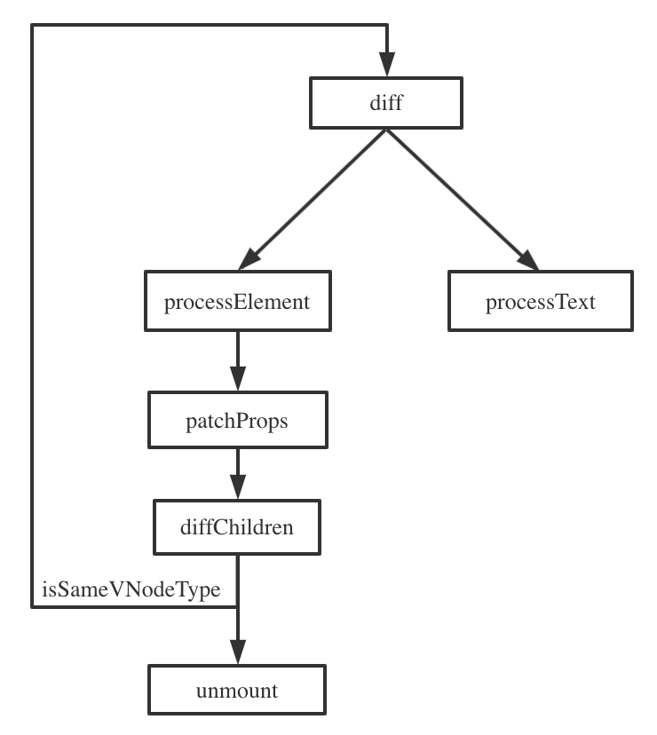

<!-- markdownlint-disable MD033 -->
# Simplest VDOM Runtime

<details>
<summary>1. 核心部分<strong>小于 200 行</strong></summary>

去掉 key diff 后真的很简单
</details>

<details>
<summary>2. 框架原理入门的入门</summary>

Go deeper 部分就是框架原理入门
</details>

<details>
<summary>3. 学习框架原理的起点</summary>

Go deeper 链接中的链接中的链接……
</details>

## 1. VNode

```text
[Virtual Node]
--------------
[DOM Node]
```

用来找到两个帧之间不同的地方（diff），仅对不同的地方进行实际的 DOM 更新（patch），减少与 DOM 通信、回流重回等性能消耗

于是需要在真是的 DOM Node 上建立一层 VNode，用以描述帧的 DOM 结构

就是普通的 JS 对象，存在内存中，下一帧的 VNode 和当前帧的 VNode 进行比对，找到需要更新的地方，然后做相应处理

> Vue 是一边 diff 一边 patch；React16 是先 diff 然后对要更新的地方做标记（render phase），之后在对标记过的地方进行 patch（commit phase）。实现的不同也决定了一些 feature 的不同

前两部分先不考虑组件，仅对应 DOM 结构的两种 VNode，标签（div、span……）和文本（#text）进行处理

```js
{
  type,
  props,
  key, // key diff 用的
  node, // 宿主环境的元素（dom node……）
  parent, // parent VNode
  children, // VNode[]，建立内部 VNode 树结构
}
```

## 2. Diff

```text
    div                    diff
    / \                diffChildren
  div div           diff          diff
   |   |        diffChildren  diffChildren
hello  world        diff          diff
```



1. 只对同级元素进行 diff（diffChildren）
2. 两个不同类型的元素会产生出不同的树（isSameVNodeType）
3. 开发者可以通过 key 来暗示哪些子元素在不同的渲染下能保持稳定（key diff）

key diff 位于 diffChildren 这里，是 diff 算法最难的地方，代码中我们简化了很多，详细的可以看 Go deeper 链接中的链接

> Vue 使用的是递归式的 diff，React16 使用的是迭代式的 diff，区别在于递归式的不可打断，迭代式的可以打断，这也决定了两个框架 feature 的不同
> 代码中因为参考的是 Vue3 的源码，边 diff 边 patch，所以命名是 patch，但实际上做的是 diff + patch

## 3. Component

现在我们加入 Component 的 diff

```js {7-15}
const hooksComponent = {
  patch(internals, { n1, n2, container }) {
    if (n1 == null) {
      const instance = n2.instance = {
        subTree: null,
        vnode: n2,
        update: () => {
          // this: extends hooksComponent
          const renderResult = this.render(instance.vnode.props) // 获取 render 的结果

          instance.vnode.children = [renderResult] // 不考虑 Fragment，组件的子节点只有一个
          renderResult.parent = instance.vnode // 建立父子联系
          internals.patch(instance.subTree, renderResult, container) // 跟上一次结果进行 diff
          instance.subTree = renderResult // 存储这次结果，供下一次 patch 用
        },
      }
    } else {
      const instance = n2.instance = n1.instance
      instance.vnode = n2
    }
    n2.instance.update()
  },

  unmount(internals, { vnode, doRemove }) {
    vnode.children.forEach(c => unmount(c, doRemove))
  },

  getNode(internals, { vnode }) {
    return vnode.instance.subTree.node
  }
}

export const createHooksComponent = (render) => ({ ...hooksComponent, render }) // “继承“ patch、unmount 等方法
```

现在的组件的更新是同步的，就是说比如一个 input，输入多少次就触发了多少次 diff，可以通过异步进行优化

```js
enqueueRender(n2.instance.update)
```

## 4. State

组件的 State 我们通过 Hooks “钩”入

```js
const instance = n2.instance = {
  // ...
  hooks: {
    list: [],
    pendingEffects: [],
  },
  update: () => {
    currentHooksComponent = instance
    currentIndex = 0
    // this: extends hooksComponent
    const renderResult = this.render(instance.vnode.props)
    currentHooksComponent = null
    // ...
    invokePendingEffects(instance)
  },
}

function getHookState(index) {
  const { hooks } = currentHooksComponent
  if (index >= hooks.list.length) {
    hooks.list.push({});
  }
  return hooks.list[index];
}

export function useEffect(effect, args) {
  const hookState = getHookState(currentIndex++);
  if (argsChanged(hookState.args, args)) {
    hookState.effect = effect;
    hookState.args = args;
    currentHooksComponent.hooks.pendingEffects.push(hookState);
  }
}
```

> 两类 Reactivity 的处理方式：一种是以 Vue 为代表的 mutable + change tracking。即可变的数据结构，配合变更追踪，触发更新函数。另一种是以 React 为代表的 immutability + referential equality testing。即不可变的数据结构，配合反复执行的渲染函数，以及在函数执行过程中，通过数据的引用相等性判断，找出变更部分，只应用变化的部分到 UI 上。—— [工业聚：打破框架的范式之争](https://zhuanlan.zhihu.com/p/82958907)

## 5. Go deeper

- [ahabhgk/simple-preact](https://github.com/ahabhgk/simple-preact)
- [ahabhgk/simple-vue3](https://github.com/ahabhgk/simple-vue3)
